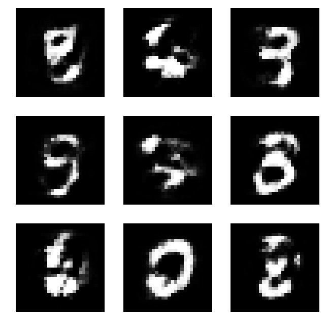
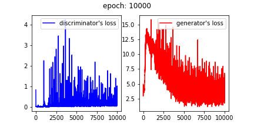

# Simple_GAN_for_Keras
Simple GAN model for Keras using very simple model originally proposed by [Goodfellow et al. (2014)](https://arxiv.org/abs/1406.2661) and [the MNIST database](http://yann.lecun.com/exdb/mnist/).  
The paper does not have any specific networks so the models on the web articles are referenced.

#### Generated Images

#### Losses of Generator and Discriminator

# References
* [Goodfellow et al. (2014)](https://arxiv.org/abs/1406.2661)
* [bstriner/keras-adversarial](https://github.com/bstriner/keras-adversarial)
* [はじめてのGAN](https://elix-tech.github.io/ja/2017/02/06/gan.html)
* [Generative Adversarial Networks(GAN)を勉強して、kerasで手書き文字生成する](http://yusuke-ujitoko.hatenablog.com/entry/2017/05/08/010314) (The codes here are basically forked from this article.)
