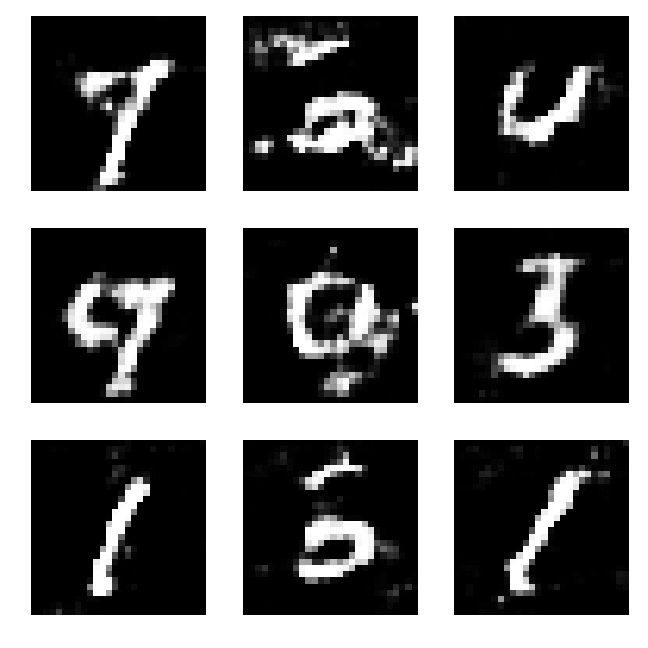
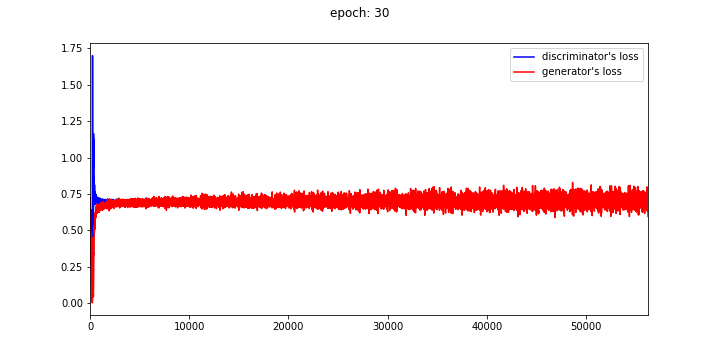
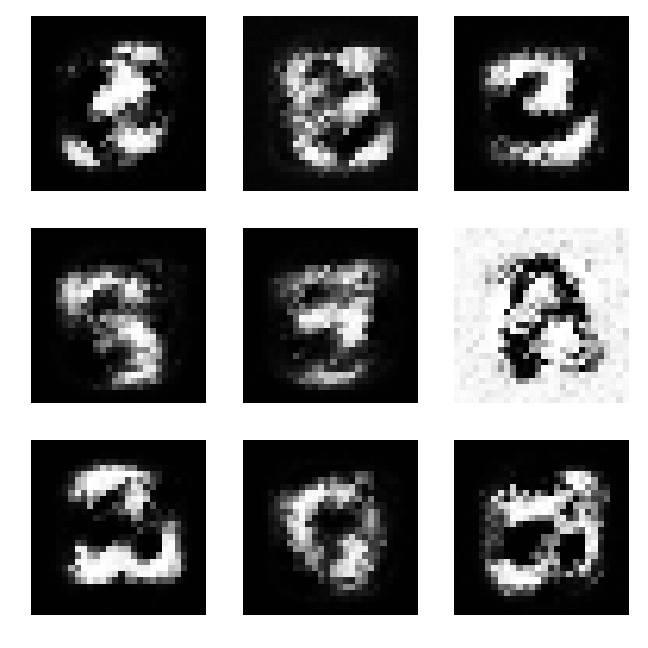
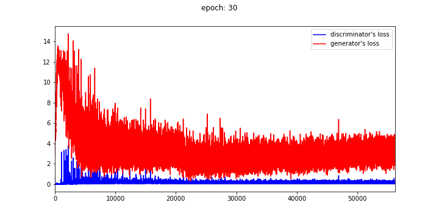

# GAN-DCGAN-for-Keras
simple Keras scripts for GAN proposed by [Goodfellow et al. (2014)](https://arxiv.org/abs/1406.2661) and for DCGAN proposed by [Radford et al. (2015)](https://arxiv.org/abs/1511.06434) using [the MNIST database](http://yann.lecun.com/exdb/mnist/).  
The websites below are referenced to build the network.

## DCGAN

## GAN

# References
* [Goodfellow et al. (2014)](https://arxiv.org/abs/1406.2661)
* [bstriner/keras-adversarial](https://github.com/bstriner/keras-adversarial)
* [はじめてのGAN](https://elix-tech.github.io/ja/2017/02/06/gan.html)
* [Generative Adversarial Networks(GAN)を勉強して、kerasで手書き文字生成する](http://yusuke-ujitoko.hatenablog.com/entry/2017/05/08/010314)
